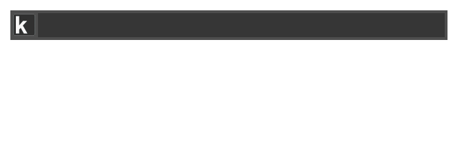

<p align="center">
  
</p>

# Keypirinha Plugin: URLShortener

This is URLShortener, a plugin for the
[Keypirinha](http://keypirinha.com) launcher.

Shorten your URLs by using multiple services directly through Keypirinha launcher.



## Download
https://github.com/Fuhrmann/keypirinha-url-shortener/releases/latest


## Install

#### Managed
[@ueffel](https://github.com/ueffel) wrote [PackageControl](https://github.com/ueffel/Keypirinha-PackageControl), a package manager that eases the install of third-party packages.
It must be installed manually.

#### Manual
Once the `URLShortener.keypirinha-package` file is installed,
move it to the `InstalledPackage` folder located at:

* `Keypirinha\portable\Profile\InstalledPackages` in **Portable mode**
* **Or** `%APPDATA%\Keypirinha\InstalledPackages` in **Installed mode** (the
  final path would look like
  `C:\Users\%USERNAME%\AppData\Roaming\Keypirinha\InstalledPackages`)


## Usage

Open Keypirinha and type 'URL Shortener'. There are three catalog items implemented by this plugin:

- `URL Shortener`: Use this to shorten a URL using the default service specified in the configuration. Select this item, paste or type the URL you want to shorten and wait for the output.
- `URL Shortener: History`: Navigate through list of your shortened URLs. The history can be disabled in configuration. Once this item is selected the history will appear as suggestions.
- `URL Shortener: Clear history`: Wipe the history of shortened URLs.

## Configuration

```
# Here you can specify the main service used to shorten the url
# Accepted values: google, tinyurl, isgood, bitly
# * Default: google
main_service = google

# Enabling history will allow you to see all your shortened urls
# * Default: yes
enable_history=yes
```

## Suported services
- **Google (default, http://goo.lg)** - This plugin already ships with a Google URL Shortener API key. This is my own personal key. All short URLs are public. You are not required, but you can create your own API KEY if for some reason this service stop working. 
- **TinyURL (http://tinyurl.com)** - No further configuration necessary.
- **is.gd (http://is.gd)** - No further configuration necessary.
- **Bitly (http://bit.ly)** - An API key is required. Generate an API KEY on [bit.ly's website](https://bitly.com/a/oauth_apps).

## Change Log
### v1.0
* Released

## License

This package is distributed under the terms of the MIT license.


## Credits

Icon by [paomedia](https://www.iconfinder.com/paomedia)
